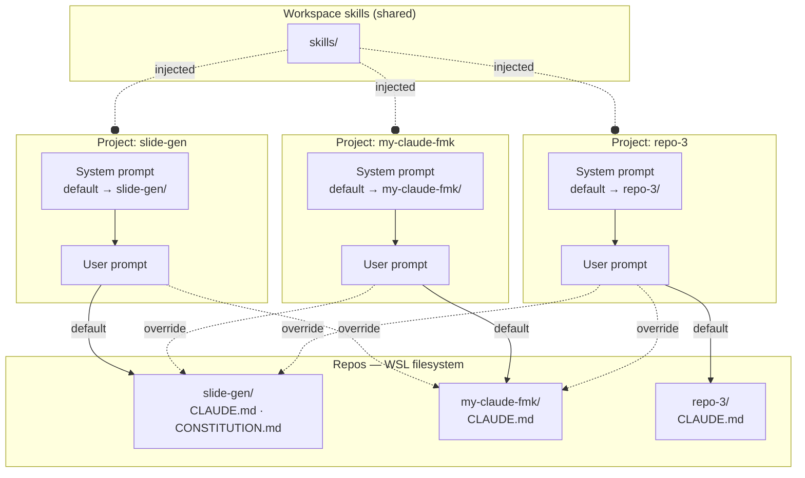

# Configuration Layer Guide
> How to use system prompt, CLAUDE.md, CONSTITUTION.md, and FRAMING.md
> Version 2.0

---

## Overview

This framework uses five configuration layers across a multi-project architecture. Each layer has a distinct owner, scope, and authority. Getting the boundaries right is what keeps the system maintainable and outputs coherent across projects.

**Architecture model:** multiple Claude Desktop projects, each with its own system prompt and a default repo. A shared workspace skills layer is available to all projects. Routing to repos and skills is prompt-driven and MCP-dependent — not a native platform feature.

| Layer | File / Location | Owner | Scope | Changes when |
| :--- | :--- | :--- | :--- | :--- |
| Routing | system prompt (per project) | Operator | Which repo Claude targets by default; when to override | A new repo is added or routing rules change |
| Behaviour | system prompt (per project) | Operator | How Claude acts within the routed repo | Workflows or rules change |
| Defaults | `CLAUDE.md` (per repo) | Operator | What all outputs in that repo look like | A new shared standard is needed |
| Use-case rules | `CONSTITUTION.md` (per use-case) | Operator | What a specific use-case requires | Use-case goals or constraints change |
| Intent | `FRAMING.md` (per use-case) | User | Why the use-case exists | User intent changes |



---

## Layer 0 — Workspace Skills

**What it governs:** reusable instruction sets shared across all projects. Skills are loaded into each project via explicit system prompt instructions + Filesystem MCP reads.

**What it does not govern:** routing, repo-specific defaults, or use-case rules.

**Key principle:** skills are workspace-wide infrastructure, not owned by any one project or repo. A skill that only makes sense for one repo belongs in that repo, not the shared workspace.

**What belongs here:** any skill that is reusable across two or more repos without modification — doc-writer, tech-reviewer, business-analyst, skill-creator.

**Maintenance note:** skills load only if (a) the system prompt instructs Claude to look for them and (b) the Filesystem MCP is connected. If MCP is disconnected, skills are silently unavailable — no error is raised.

---

## Layer 1 — System Prompt (per project)

**What it governs:** two things — routing and behaviour.

*Routing:* declares the default repo for this project and the rules for overriding to another repo. This is a prompt engineering convention, not a platform feature. Claude follows the declared paths via Filesystem MCP reads.

*Behaviour:* how Claude acts once routed — how it reads files, when it writes, what triggers a workflow, what it never does without confirmation.

**What it does not govern:** the content or format of any deliverable.

**Key principle:** system prompts should be clear and use simple, direct language at the right altitude — specific enough to guide behaviour effectively, yet flexible enough to provide strong heuristics rather than brittle hardcoded logic.

**What the system prompt defines:**

- Default repo path and override rules (routing)
- Workspace skills paths to load
- Roles and persona
- Workflow triggers and steps
- File write rules (never write without confirmation, never modify FRAMING.md)
- Defaults for tone and output style (concise, no preamble, act directly)

**What does not belong here:**

- Output format rules (version blocks, default file type) → `CLAUDE.md`
- Use-case-specific content rules → `CONSTITUTION.md`
- Project intent or goals → `FRAMING.md`
- Repo-specific content of any kind — keep system prompts generic across repos

**Maintenance note:** the system prompt is the most expensive layer to change — it governs all conversations in the project. Run a token audit (see `prompt-maintenance.md`) whenever routing rules or workflows change. Add a new repo to the routing table when a new repo is added to the workspace.

---

## Layer 2 — CLAUDE.md (per repo)

**What it governs:** shared defaults that apply to every output across every use-case in that repo, unless overridden by a CONSTITUTION.md.

**What it does not govern:** anything specific to one use-case, or routing between repos.

**Key principle:** CLAUDE.md is the repo's baseline contract. It answers: "if CONSTITUTION.md says nothing about X, what do we do?" Each repo has its own CLAUDE.md — defaults are not shared across repos.

**What belongs here:** output format standards, tone, language, structural conventions, and any rule that applies to every use-case in this repo without exception.

**What does not belong here:**

- Anything that only applies to one use-case → `CONSTITUTION.md`
- Project goals or problems → `FRAMING.md`
- Rules specific to another repo → that repo's `CLAUDE.md`

**Maintenance note:** Before adding anything to CLAUDE.md, ask: "does this apply to every use-case in this repo?" If not, it belongs in CONSTITUTION.md. If it would apply identically across all repos, consider whether it belongs in a workspace skill instead.

---

## Layer 3 — CONSTITUTION.md (per use-case)

**What it governs:** the rules that make a specific use-case's outputs valid and in-scope.

**What it does not govern:** how Claude behaves (system prompt), what format outputs take (CLAUDE.md), or rules from another repo.

**Key principle:** CONSTITUTION.md overrides CLAUDE.md. It is the highest-authority document on content — but only for its own use-case within its own repo. It is derived from FRAMING.md and must stay aligned with it.

**Cross-repo note:** when an explicit override routes Claude to another repo, the target repo's CLAUDE.md and CONSTITUTION.md apply — not the originating project's. The originating system prompt governs behaviour only; content rules follow the routed repo.

**What belongs here:** root problem alignment, objective scope, mandatory outcome linkage, output quality criteria — anything that is specific to this use-case and would not be valid word-for-word in another use-case.

**What does not belong here:**

- Generic output format rules → `CLAUDE.md`
- Flagging and version block mechanics → `CLAUDE.md`
- Project intent in the user's own words → `FRAMING.md`

**Maintenance note:** run `revise constitution <use-case-id>` whenever FRAMING.md changes. Never edit CONSTITUTION.md directly without first reading FRAMING.md. Flag any conflict between the two before writing.

---

## Layer 4 — FRAMING.md

**What it governs:** the authoritative statement of why this use-case exists — problems, objectives, expected improvements.

**What it does not govern:** anything about how Claude operates or what outputs look like.

**Key principle:** FRAMING.md is user-owned and immutable by Claude. It is the source of truth that all other layers derive from. Every claim in CONSTITUTION.md must be traceable here.

**In this project, FRAMING.md defines:**

- The 3 root problems
- The primary objective (predictive forecasting engine)
- The secondary objective (recruitment automation)
- The expected improvements (fulfillment rate, lead time, etc.)

**What does not belong here:**

- Output rules of any kind
- Workflow instructions
- Anything Claude should enforce — that goes in CONSTITUTION.md

**Maintenance note:** Only the user edits FRAMING.md. If Claude identifies a conflict between FRAMING.md and CONSTITUTION.md, it flags it and proposes a constitution revision — it never proposes a change to FRAMING.md.

---

## Precedence Chain

```
FRAMING.md          ← source of truth (user intent)
    ↓ derived from
CONSTITUTION.md     ← use-case rules (overrides CLAUDE.md)
    ↓ overrides
CLAUDE.md           ← repo defaults (scope: current routed repo)
    ↓ overrides
system prompt       ← routing + behaviour engine
    ↑ injects
workspace skills    ← shared across all projects (MCP-loaded)
```

When there is a conflict, the higher layer wins. Two exceptions:
- The system prompt's **behavioural rules** (e.g. "never write without confirmation") are not content rules and cannot be overridden by any content layer.
- **Routing determines which CLAUDE.md applies.** When Claude is routed to a different repo via an explicit override, the target repo's CLAUDE.md and CONSTITUTION.md govern content — the originating project's content layers do not follow across repos.

---

## Decision Guide — Where Does This Belong?

| Question | Layer |
| :--- | :--- |
| Which repo does this project target by default? | System prompt (routing) |
| When should Claude override to another repo? | System prompt (routing) |
| How should Claude respond when a trigger fires? | System prompt (behaviour) |
| What files can Claude write, and when? | System prompt (behaviour) |
| Is this skill reusable across multiple repos? | Workspace skills |
| What should every output in this repo contain? | CLAUDE.md (that repo) |
| What tone and structure apply across all use-cases in this repo? | CLAUDE.md (that repo) |
| What problems must this use-case's outputs address? | CONSTITUTION.md |
| What objectives must outputs serve? | CONSTITUTION.md |
| What does the user need and why? | FRAMING.md |
| What improvements is the user trying to achieve? | FRAMING.md |

---

## Lessons Learned

**Lesson 1 — CONSTITUTION scope creep** (slide-gen, use-case-1)

CONSTITUTION.md accumulated generic output rules (default .md format, version block structure, flagging conventions) that had nothing to do with the use-case's specific goals. Fix: generic output standards moved to CLAUDE.md, CONSTITUTION.md scoped to use-case content only.

Rule derived: if a rule in CONSTITUTION.md would be valid word-for-word in any other use-case in the same repo, it belongs in CLAUDE.md.

**Lesson 2 — Routing is not automatic** (framework-level)

Default repo routing only works when (a) the system prompt contains explicit path declarations and (b) the Filesystem MCP is connected. If MCP is disconnected, Claude cannot reach any repo and will not raise an error — it will silently fall back to its training knowledge. Always verify MCP connection at session start.

**Lesson 3 — Cross-repo content rules do not travel** (framework-level)

When Claude is routed to another repo via an explicit override, the originating project's CLAUDE.md does not apply to that repo's outputs. The target repo's own CLAUDE.md governs. Do not put cross-repo content expectations in the system prompt — they belong in each repo's CLAUDE.md.

---

## Authoring a New Use-Case

1. User writes `FRAMING.md` — problems, objectives, expected improvements
2. Trigger `revise constitution <use-case-id>` — Claude reads FRAMING.md and generates a scoped CONSTITUTION.md
3. Claude flags any gap or conflict between the two before writing
4. CLAUDE.md requires no changes unless a new shared default is needed
5. System prompt requires no changes unless a new workflow or routing rule is needed

## Adding a New Repo to the Workspace

1. Create the repo with a `CLAUDE.md` defining its output defaults
2. Add the repo path to the routing table in each project's system prompt that needs to reach it
3. Run a token audit on each updated system prompt (see `prompt-maintenance.md`)
4. Verify Filesystem MCP has read/write access to the new repo path
5. Test routing with a dry-run prompt before committing the system prompt change

---

*Cross-reference: `prompt-maintenance.md` for token audit methodology. Each repo's `CLAUDE.md` for repo-level defaults.*

---

**Document Version**

| Field | Value |
| :--- | :--- |
| Version | 2.0 |
| Last Updated | 2026-03-13 |
| Status | Final |
