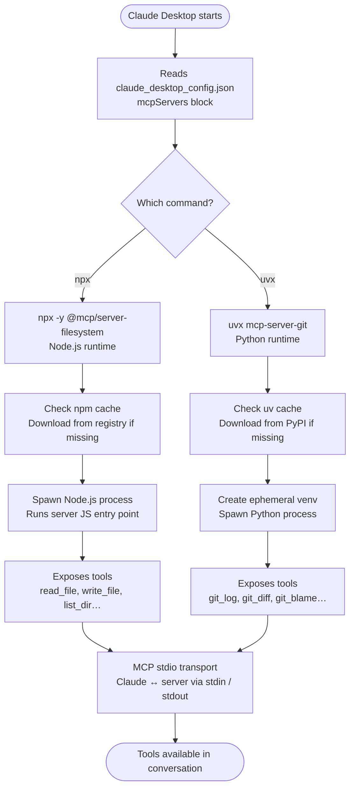

# Claude Power Stack — Technical Explainer

> Windows 11 | Claude Desktop + MCP + Claude Code
> Version 2.4

---

## Architecture Overview

```
┌─────────────────────────────────────────────────────┐
│                    YOU (Human)                      │
└───────────────────┬─────────────────────────────────┘
                    │ natural language
┌───────────────────▼─────────────────────────────────┐
│              CLAUDE DESKTOP                         │
│         (chat interface + MCP host)                 │
└───────┬───────────────────────────┬─────────────────┘
        │                           │
        │ Remote MCP                │ Local MCP
        │ Customize > Connectors    │ Settings > Extensions
        │                           │
┌───────▼───────┐         ┌─────────▼───────┐
│ Hosted Service│         │ Local .mcpb     │
│ e.g. Gamma    │         │ e.g. Filesystem │
│ e.g. Slack    │         │ e.g. custom     │
└───────┬───────┘         └─────────┬───────┘
        │ HTTPS                     │ stdio
        │ via Anthropic infra       │ local process
        └───────────────────────────┘

┌─────────────────────────────────────────────────────┐
│              CLAUDE CODE (separate)                 │
│         (terminal agent, file system access)        │
└─────────────────────────────────────────────────────┘
```

---

## Stack Components

### 1. Claude Desktop

**What it is:** Electron-based desktop application. It is the MCP host — responsible for managing and communicating with MCP servers via two distinct paths.

**What it does technically:**

- Manages Remote MCP connections via **Customize > Connectors** (hosted services)
- Manages Local MCP extensions via **Settings > Extensions** (.mcpb bundles)
- Exposes MCP server tools to the LLM as callable functions
- Manages the conversation context window

**Key settings paths:**

- `Customize > Connectors` — hosted/remote MCP integrations (Gamma, Slack, etc.)
- `Settings > Extensions` — local MCP bundles (.mcpb files)
- `Settings > Developer` — advanced JSON config and logs (developers only)

> ✅ Verified: `Customize > Connectors` path — Claude Desktop (2026-03-26)

---

### 2. MCP (Model Context Protocol)

**What it is:** An open protocol developed by Anthropic that standardizes how LLMs communicate with external tools and data sources.

**What it does technically:**

- Defines a JSON-RPC message format over stdio (local) or HTTPS (remote) transport
- Each MCP server exposes **tools** (callable functions), **resources** (readable data), and **prompts** (reusable templates)
- Claude Desktop acts as the **MCP client/host**; each integration runs as an **MCP server**
- Tool definitions are injected into the LLM context, enabling Claude to decide when and how to call them

**Protocol flow:**

```
Claude Desktop → initialize request  → MCP Server
Claude Desktop ← tools/list response ← MCP Server
Claude (LLM)   → tool call decision
Claude Desktop → tools/call request  → MCP Server
Claude Desktop ← tool result         ← MCP Server
Claude (LLM)   → incorporates result into response
```

---

### MCP Server Spawn Flow

> How Claude Desktop resolves, downloads, and starts an MCP server process at session initialisation — from config file to callable tool.

When Claude Desktop starts, it reads the `mcpServers` block in `claude_desktop_config.json` and spawns a child process for each entry. The command field determines the runtime: `npx` targets Node.js servers published to npm; `uvx` targets Python servers published to PyPI. Each runtime checks a local cache before downloading, then spawns the server process over stdio. Once running, the server advertises its tools to Claude Desktop — at which point they become available in the conversation.



---

### 3. The Two MCP Paths

This is the most critical distinction — using the wrong path is why connections fail.

|                  | Remote MCP                         | Local MCP                      |
|:---------------- |:---------------------------------- |:------------------------------ |
| What it is       | Hosted service on the internet     | Server running on your machine |
| Transport        | HTTPS via Anthropic infrastructure | stdio (local process)          |
| How to connect   | Customize > Connectors             | Settings > Extensions (.mcpb)  |
| Examples         | Gamma, Slack, Google Drive, Notion | Filesystem, custom tools       |
| Node.js required | ❌                                 | ❌ (bundled in Claude Desktop) |
| JSON config file | ❌ Does not work                   | ✅ Developer use only          |
| Authentication   | OAuth flow in browser              | API key in extension settings  |

**Rule:** If a service has a hosted MCP server (most SaaS tools do), always use **Customize > Connectors**. The `claude_desktop_config.json` file is for developers building custom local tools only.

---

### 4. Remote MCP — Connectors

**What they are:** Hosted MCP servers run by third-party services (Gamma, Slack, GitHub, etc.) accessed by Claude Desktop over HTTPS via Anthropic's infrastructure.

**How to connect — two sub-paths:**

**A) Service is in the built-in directory** (Google Drive, GitHub, Gmail, Google Calendar):

1. `Customize > Connectors > Browse Connectors`
2. Find the service and click Connect → complete OAuth in browser

**B) Service is not in the directory** (Gamma, Notion, Slack, and most others):

1. `Customize > Connectors > Add custom connector`
2. Enter the service's remote MCP server URL
3. Click Add → complete OAuth in browser

No Node.js, no npx, no JSON config required. Authentication is handled entirely via OAuth.

---

### 5. Local MCP — Desktop Extensions (.mcpb)

**What they are:** Bundled packages containing a local MCP server and a `manifest.json`. They install with one click and run on your machine via stdio transport.

**How to install:**

- From directory: `Settings > Extensions > Browse Extensions`
- From file: `Settings > Extensions > Advanced Settings > Install Extension > select .mcpb file`

Claude Desktop includes a built-in Node.js runtime — no Node.js install required for .mcpb extensions.

**For developers:** The `claude_desktop_config.json` remains valid for custom local servers during development, but .mcpb is the correct production format.

---

### 6. Claude Code

**What it is:** A terminal-based agentic coding tool — a separate product from Claude Desktop.

**What it does technically:**

- Installs natively on Windows — requires Git for Windows (Git Bash), no WSL required
- WSL1 and WSL2 are both supported as an alternative to native Windows
- Has direct access to your **file system**, **shell**, and **git**
- Can read, write, create, and delete files autonomously
- Executes shell commands to run tests, install packages, start servers
- Operates in a long-horizon agentic loop
- Supports its own MCP configuration (separate from Claude Desktop)
- Native binary — no Node.js dependency

> ✅ Verified: Claude Code native Windows install (Git for Windows required, WSL optional, no Node.js needed) — code.claude.com/docs/en/setup, 2026-03-26

**Key distinction from Claude Desktop:**

| Capability     | Claude Desktop     | Claude Code                          |
|:-------------- |:------------------:|:------------------------------------:|
| Interface      | GUI chat           | Terminal                             |
| File access    | Via MCP only       | Native                               |
| Shell access   | Via MCP only       | Native                               |
| Use case       | Tool orchestration | Agentic coding                       |
| MCP support    | ✅                 | ✅ (separate config)                  |
| Windows native | ✅                 | ✅ (Git for Windows required)         |
| WSL required   | ❌                 | ❌ (optional — WSL1 and WSL2 supported) |

---

## Data Flow — End to End (Remote MCP example)

```
1. You type a prompt in Claude Desktop
2. Claude Desktop sends prompt + tool definitions to Claude LLM (Anthropic API)
3. LLM decides to call a tool (e.g. gamma_generate)
4. Claude Desktop routes the call via Anthropic infrastructure to Gamma's hosted MCP server
5. Gamma's server processes the request and generates the presentation
6. Result (e.g. presentation URL) returns through Anthropic infra to Claude Desktop
7. Claude Desktop feeds the result back into the LLM context
8. LLM generates a final natural language response to you
```

---

## Security Model

- Remote MCP uses OAuth — no API keys stored locally
- Local MCP extensions (.mcpb) store sensitive config in Windows Credential Manager (encrypted)
- `claude_desktop_config.json` stores API keys as plaintext — treat as a secret if used
- Local MCP servers run with your Windows user privileges — only install from trusted sources
- stdio transport means local MCP servers cannot be accessed from the network

---

## Recommended MCP Starter Stack

| Service               | Type          | How to Connect                           |
|:--------------------- |:-------------:|:---------------------------------------- |
| Gamma                 | Remote        | Customize > Connectors > Add custom      |
| Google Drive          | Remote        | Customize > Connectors > Browse          |
| Slack                 | Remote        | Customize > Connectors > Add custom      |
| Notion                | Remote        | Customize > Connectors > Add custom      |
| GitHub                | Remote        | Customize > Connectors > Browse          |
| Filesystem            | Local (.mcpb) | Settings > Extensions > Browse           |
| Custom internal tools | Local (.mcpb) | Settings > Extensions > Install .mcpb    |

---

*Doc 1 of 2 — see 02-claude-stack-setup-manual.md for installation instructions*

---

| Field        | Value      |
|:------------ |:---------- |
| Version      | 2.4        |
| Last Updated | 2026-03-26 |
| Status       | Final      |

*v2.4 — Section 6 Claude Code: corrected "Requires WSL2 on Windows — cannot run natively in PowerShell" — Claude Code installs natively on Windows (Git for Windows required); WSL is optional not required; native binary has no Node.js dependency. Comparison table updated with Windows native and WSL required rows. Verified code.claude.com/docs/en/setup 2026-03-26.*
